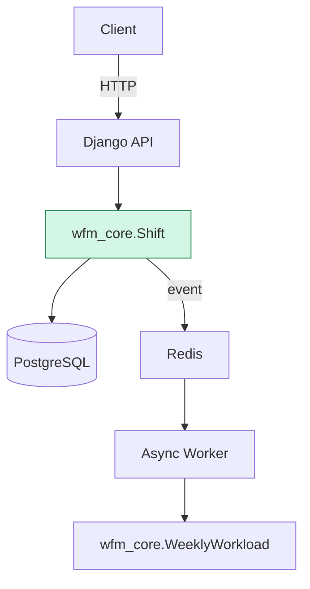

```mermaid
graph LR
    A[Client] -->|HTTP/JSON| B[Django API\n(sync, DRF)]
    B -->|Read/Write| C[(PostgreSQL)]
    B -->|PUBLISH event| D[(Redis Streams)]
    D -->|CONSUME event| E[Async Worker\n(aggregation logic)]
    E -->|Update aggregates| C
```


### Domain Model (TDD)

