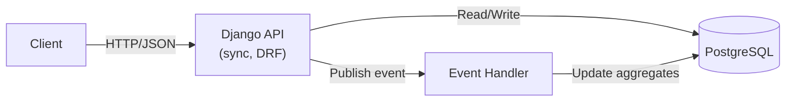
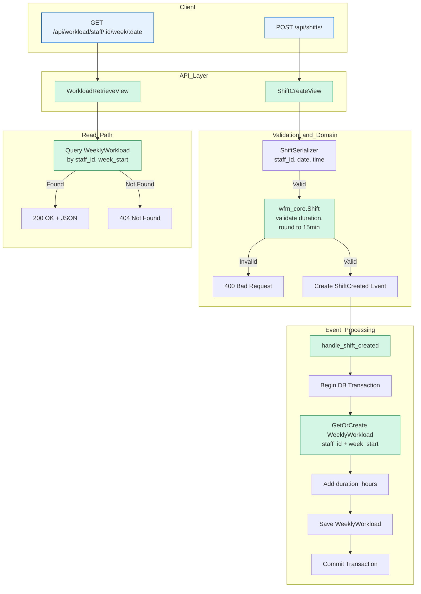
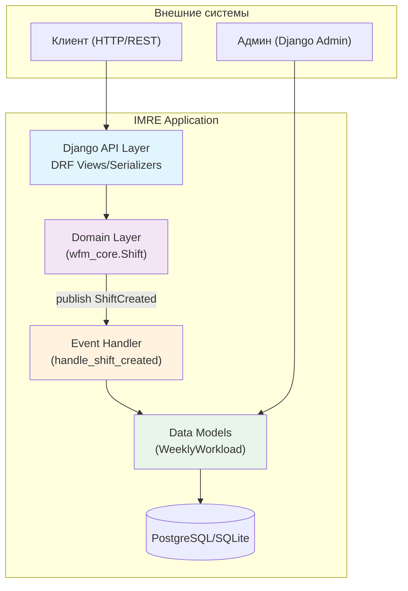

# IMRE: Intelligent Workforce Management Reference Implementation

Event-driven system for shift scheduling and workload aggregation.  
Built with **Clean Architecture**, **Domain-Driven Design**, and **synchronous reliability**.

## High-Level Architecture



✅ No message broker (Redis/Kafka) — synchronous processing ensures simplicity and consistency for MVP.

## Request Flow



## Domain Model (Clean Architecture + DDD)



✅ **Green = implemented and working**

## Features

- ✅ **Shift creation API** (`POST /api/shifts/`)
  - Validates duration (1–12 hours)
  - Enforces start < end
  - Rounds duration to 15-minute intervals
- ✅ **Workload aggregation** (`GET /api/workload/staff/{staff_id}/week/{week_start}`)
  - Stores weekly totals in database
  - `week_start` must be **Monday** of the ISO week (e.g., `2026-06-15`)
- ✅ **Event-driven design**
  - `ShiftCreated` event published on success
  - Synchronous processing
- ✅ **Test coverage**
  - Unit tests for domain (`wfm_core`)
  - Integration tests for API
  - End-to-end tests for full flow
- ✅ **Deployment-ready**
  - `render.yaml` included
  - **Production**: PostgreSQL on Render.com
  - **Development**: SQLite (zero setup)

## Tech Stack

- **Backend**: Python 3.11, Django 5.0, DRF
- **Domain**: Pure Python (no framework dependencies)
- **Database**:
  - **Development**: SQLite (zero setup)
  - **Production**: PostgreSQL
- **Deployment**: Render.com (free tier)
- **Quality**: ruff, pytest, pre-commit

## Quick Start

```bash
python -m venv .venv
source .venv/bin/activate  # Linux/macOS

pip install -r requirements.txt
python manage.py migrate
python manage.py runserver
```

Then:

```bash
# Create a shift
curl -X POST http://localhost:8000/api/shifts/ \
  -H "Content-Type: application/json" \
  -d '{"staff_id": 17, "date": "2026-06-15", "start_time": "09:00", "end_time": "18:00"}'

# Get workload (week_start must be Monday)
curl http://localhost:8000/api/workload/staff/17/week/2026-06-15/
```

## Deployment

Live demo: [https://imre-340q.onrender.com](https://imre-340q.onrender.com)

Push to GitHub → auto-deployed to [Render.com](https://render.com).

## Architecture Notes

- **Why synchronous?** Simplicity, atomicity, and debuggability for MVP.
- **Why no Redis?** Avoid operational complexity until needed.
- **Known limitation**: Sending the same shift creation request multiple times will result in duplicate hours, because shifts themselves are not stored or deduplicated.
  - The **weekly aggregate** is updated correctly (thanks to `unique_together` on `(staff_id, week_start)`),
  - But there is **no uniqueness constraint on shifts** (e.g., `(staff_id, date, start_time, end_time)`).
  - → **Technical debt**: add shift persistence with uniqueness, or implement request-level idempotency (e.g., via `Idempotency-Key` header).

## Roadmap

- [ ] Idempotency (prevent duplicate processing)
- [ ] Normalize any date in week to Monday (improve API UX)
- [ ] Week validation (ensure input is Monday)
- [ ] Timezone support
- [ ] Async processing (Celery + Redis)
