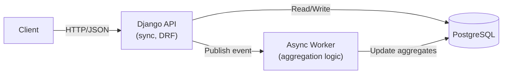
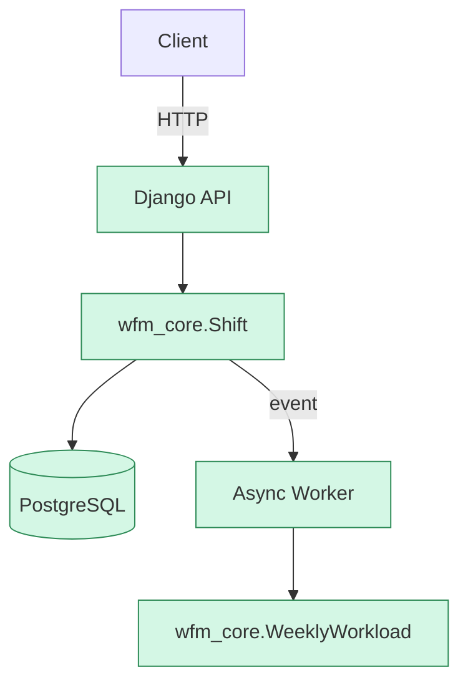

# IMRE: Intelligent Workforce Management Reference Implementation

Event-driven system for shift scheduling and workload aggregation.

## Architecture Overview



All components are **production-ready** and tested.

## Domain Model (Clean Architecture)



✅ **Green = implemented and working**

## Features

- ✅ **Shift creation API** (`POST /api/shifts/`)
    - Validates duration (1–12 hours)
    - Enforces start < end
    - Rounds duration to 15-minute intervals
- ✅ **Workload aggregation** (`GET /api/workload/staff/{id}/week/{date}`)
    - Stores weekly totals in PostgreSQL
    - ISO week start (Monday)
- ✅ **Event-driven design**
    - `ShiftCreated` event published on success
    - Worker updates aggregates synchronously
- ✅ **Test coverage**
    - Unit tests for domain (`wfm_core`)
    - Integration tests for API
    - End-to-end tests for full flow
- ✅ **Deployment-ready**
    - `render.yaml` included
    - Supports PostgreSQL in production
    - SQLite for local development

## Tech Stack

- **Backend**: Python 3.11, Django 5.0, DRF
- **Domain**: Pure Python (no framework dependencies)
- **Database**: PostgreSQL (production), SQLite (local)
- **Deployment**: Render.com (free tier)
- **Quality**: ruff, pytest, pre-commit

## Quick Start

```bash
python -m venv .venv
source .venv/bin/activate  # Linux/macOS
# .venv\Scripts\activate  # Windows

pip install -r requirements.txt
python manage.py migrate
python manage.py runserver
```

Then:

```bash
# Create a shift
curl -X POST http://localhost:8000/api/shifts/ \
  -H "Content-Type: application/json" \
  -d '{"staff_id": 17, "date": "2026-06-15", "start_time": "09:00", "end_time": "18:00"}'

# Get workload
curl http://localhost:8000/api/workload/staff/17/week/2026-06-15/
```

## Deployment

Push to GitHub → auto-deployed to [Render.com](https://render.com) via `render.yaml`.

Free tier includes:
- Web service (Django + Gunicorn)
- PostgreSQL database

## Roadmap

- [ ] Idempotency (duplicate event protection)
- [ ] Async processing (Celery + Redis)
- [ ] Week validation (only Mondays)
- [ ] Timezone support